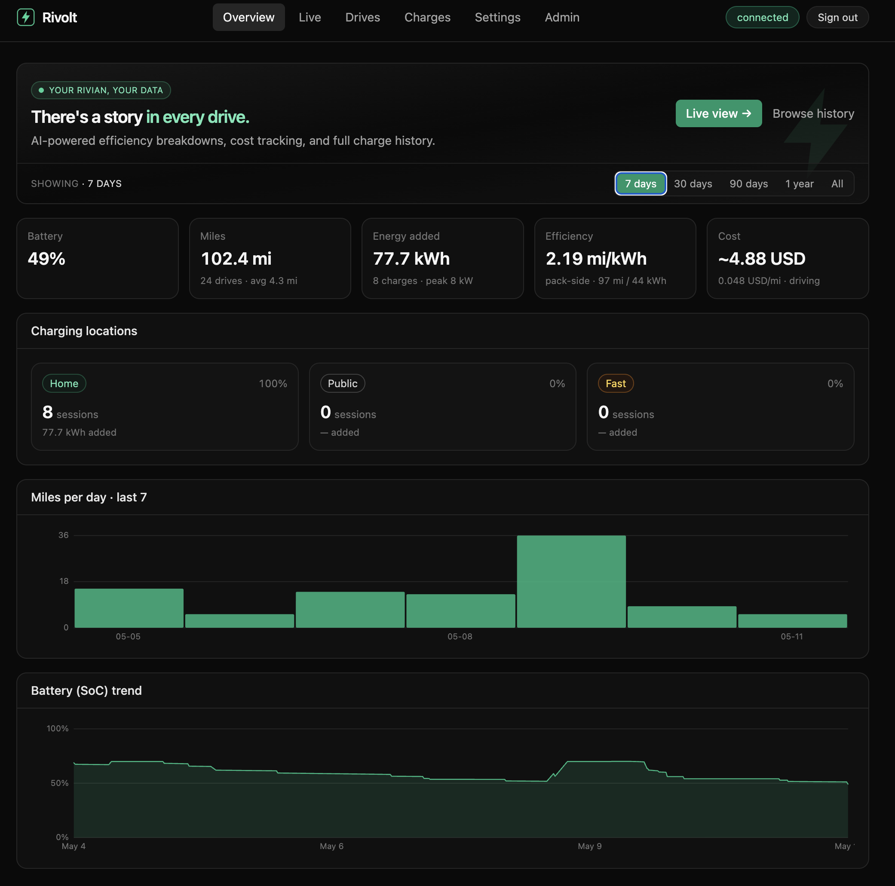
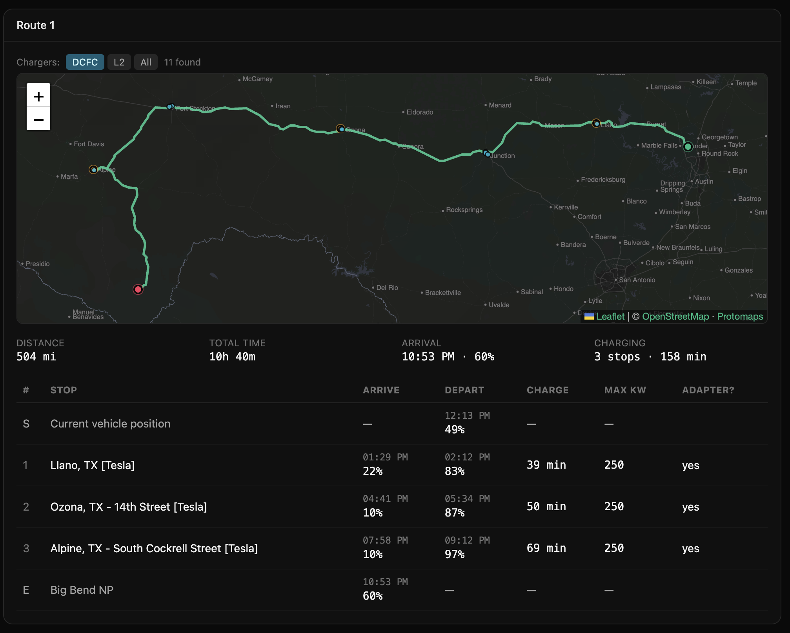

# Rivolt

> A real Rivian companion. Live telemetry, per-trip analytics, a real
> charging cost ledger, and a route planner that tells you what a road
> trip will actually cost.

**Rivolt** is an open-source companion app for Rivian vehicles. It
streams live telemetry from your truck, records every drive and
charging session against your *real* electricity rate, and plans road
trips with cost / weather / efficiency analysis built in.

The official Rivian app shows you numbers; Rivolt turns them into a
ledger you own and a planner that actually accounts for what the trip
will cost.

---

## Overview — see your truck at a glance

The home view stitches together what you actually care about right
now: current SoC and range, where the truck is, whether it's
plugged in, the most recent drive, the most recent charge, and the
rolling weekly totals (miles, kWh, $). Live telemetry comes off the
Rivian WebSocket feed at 1–5 s while you're driving and ~30 s when
parked, so the dot on the map is honest, not stale-mobile-app
honest.

---

## Drives — every trip explained

Each drive is a page, not a row. The map is road-snapped (OSRM or
Valhalla, whichever the deployment wires) and coloured by speed —
gray for parking-lot crawls, rose for interstate — over a
self-hosted Protomaps basemap. Below the map, time-aligned charts
for speed, SoC, elevation, temperature, headwind, and precipitation,
plus per-drive totals: distance, average speed, energy used,
cost at *your* home $/kWh rate, weather at the start.

A "Low GPS accuracy" pill surfaces when the Rivian modem returned
stale fixes or implausible jumps during the drive, with thresholds
that are admin-tunable so the warning doesn't fire on every parking
garage.

---

## Charges — every kWh, every dollar

Charging sessions are recorded with the same fidelity as drives:
the full power curve, peak and average kW, energy delivered, total
session time, and — when the Parallax feed is available — the
thermal split between energy going to the pack and energy spent on
battery conditioning.

Sessions are automatically bucketed `Home` / `Public` / `DCFC` by
DBSCAN clustering on coordinates and peak kW; sessions in your
home cluster price against your configured home rate, sessions
out in the wild price against the session's actual reported cost
when Rivian provides it.

---

## Trip planner — plan with cost in mind

This is the feature the app was built for. Pick origin, destination,
optional via-stops, and a departure date/time on the calendar.
Rivolt asks Rivian's own planner to lay out a route with charging
stops, then layers on top of it:

- A self-hosted Protomaps basemap with the actual route drawn in.
- A charger overlay along the route corridor — perpendicular
  distance to the polyline, not bounding box, with arc-length
  trimming near the endpoints so the destination metro doesn't
  drag in dozens of irrelevant downtown stations.
- DCFC / L2 / All toggle on the charger overlay, sourced from
  NREL AFDC data with proper DCFC vs L2 discrimination (Tesla
  Destination chargers no longer mis-classified as Supercharger).
- Last-trip persistence — closing and reopening lands you back on
  yesterday's setup.
- Departure-time-aware arrival clock: the table shows arrival
  HH:MM at every stop based on your chosen departure, not "now".

---

## Trip analysis — what the trip actually costs

After the route comes back, the **Trip analysis** card breaks it
down. The dollar figures are computed deterministically in Go —
not asked of an LLM — from your home rate, stop SoC deltas, and an
industry-default DCFC rate:

- **DCFC spend** — what you'll actually pay at fast chargers along
  the way.
- **Home-rate equivalent** — what the total energy used would have
  cost if every kWh came from your home meter; useful as a
  "what is this trip actually costing me" baseline.

Around those numbers, when an AI provider is wired by the operator,
the model writes short categorised commentary across **Cost**,
**Efficiency** (drive mode, departure timing), **Weather** (only
when there's something material — cold-snap, headwind > 15 kph,
precipitation), and **Vehicle** (tire pressures, pack size, adapter
dependency at any stop). Empty categories hide their headers.

---

## Settings — everything in one place

A five-tab layout for the per-user controls:

- **Account** — Rivian connection (with the dedicated
  Authorized Driver pattern documented in
  [`docs/SIGNUP.md`](docs/SIGNUP.md)).
- **Vehicle** — vehicle profile (pack capacity), display units,
  home location.
- **Charging** — home $/kWh rate + currency, preferred public
  networks, trip planner defaults.
- **Notifications** — per-device push subscription with per-event
  toggles (see below).
- **Data** — ElectraFi CSV import + danger zone (full JSON
  backup, reset).

---

## Notifications — push that actually fires

Web Push (VAPID), per-device subscribe. Enable once on each
device you want pinged, pick which events you care about, and
Rivolt delivers an OS-level notification on the next matching
event. Currently wired: **charging session completes** (with the
final SoC + kWh added in the body). Plug-in reminders and
anomaly alerts have the plumbing — event sources land next.

---

## Sign up

See [`docs/SIGNUP.md`](docs/SIGNUP.md) for an end-to-end walkthrough
of:
- redeeming an invite code and creating your account,
- connecting your Rivian account (with the dedicated Authorized
  Driver account approach we recommend),
- importing your history from ElectraFi,
- configuring your home charging cost,
- planning your first trip.

---

## Data ownership

- Your Rivian credentials are AES-GCM sealed and decrypted only
  in-memory at request time. Disconnect Rivian in one click.
- AI features (when enabled by the operator) are powered by an
  install-wide provider — OpenAI, Anthropic, or Google Gemini —
  configured from the admin UI. Each user's drive / trip context
  is sent to that provider only at the moment a recap or trip
  analysis is generated; nothing is mirrored to a third-party
  service in between.
- All your drive, charge, and trip data is exportable as JSON from
  Settings → Data, and deletable from the same page.
- **Read-only against the Rivian API.** Rivolt sends commands to
  no Rivian endpoint, period. It can't unlock doors, start
  charging, or change drive mode. Telemetry only.

---

## Stack

- **Single Go binary + embedded SPA.** Distroless multi-arch
  container image; the same binary serves API + static assets.
- **Go 1.25**, chi router, pgx-backed `database/sql`,
  coder/websocket for the Rivian feed, webpush-go for VAPID.
- **Postgres** with Row-Level Security, monthly partitioning on
  `vehicle_state`, envelope-encrypted secrets in `user_secrets`.
  Multi-tenant from day one: every data-plane store carries
  `user_id`, every query filters on it, every request pins
  `app.user_id` so RLS does the final enforcement at the DB.
- **React 18 + TypeScript + Vite + Tailwind v3** for the SPA;
  TanStack Query for the data layer; uPlot for time-series
  charts; Leaflet + protomaps-leaflet for maps.
- **Optional AI providers** — OpenAI, Anthropic, or Google Gemini,
  selected install-wide by the operator from the admin UI.
  Hot-swappable; calls go to the chosen provider only when an AI
  feature actually runs (trip analysis, drive recap).

---

## Status

In production at [rivolt.dev](https://rivolt.dev). Preview at
[preview.rivolt.dev](https://preview.rivolt.dev) tracks `main`.

See [`docs/ROADMAP.md`](docs/ROADMAP.md) for what's queued and
[`docs/ARCHITECTURE.md`](docs/ARCHITECTURE.md) for the load-bearing
design decisions.

---

## License

Core is MIT-licensed. Some future add-ons may ship under a separate
commercial license; details will be published alongside each add-on.

## Legal

"Rivian" is a trademark of Rivian Automotive, Inc. Rivolt is an
independent, community-built project with no affiliation to,
endorsement by, or partnership with Rivian. Reference to Rivian is
for descriptive purposes only.

Use at your own risk. Rivolt relies on unofficial access to Rivian's
APIs and may break at any time.
